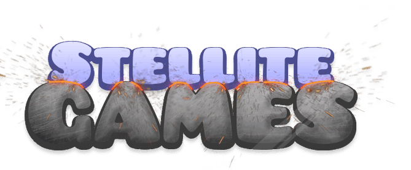

# Welcome to Stellite!

The first of its kind hybrid between a game site and a proxy site. It lets you play any web game from multiple providers in a single feed, powered by our powerful proxy technology, while providing a plethora of features via a versatile Userscript system that anyone can easily pick up and learn. You can modify any aspect of the site with basic knowledge of JS, or you can learn as you go.

Stellite is an intuitive frontend for virtually every game on the internet. Stellite's game library is expanding more rapidly than the universe. Everything is vertically integrated to ensure you have a seamless user experience.

This is what you've been waiting for. We can't wait to see what you create in our marketplace and which games you end up playing!

## What else do we do?

We offer many custom solutions for game distribution and protection of your game/proxy links against filtering. We also provide APIs to other communities that align with our goals.

## Join our [Discord](https://discord.gg/aaB7bPXrPn)
